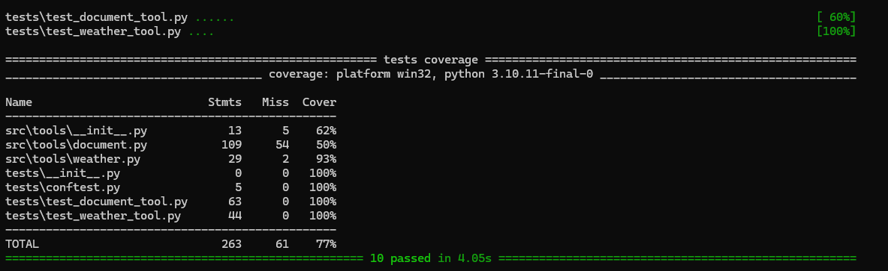
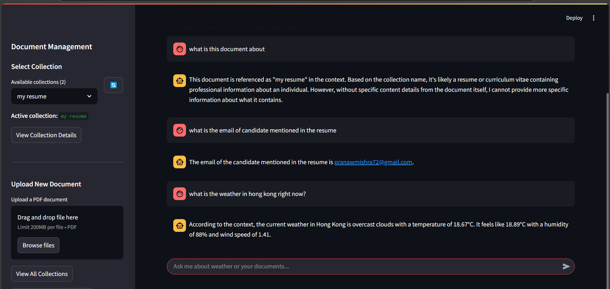

# AI Agent Pipeline with LangChain and LangGraph

This project demonstrates an agentic pipeline using LangChain, LangGraph, and LangSmith, showcasing embeddings, vector databases, RAG, and clean coding practices.

## Current Implementation Status

- ✅ Weather tool using OpenWeatherMap API
- ✅ LangGraph decision-making flow
- ✅ Command-line interface
- ✅ Streamlit UI
- ✅ Unit tests for the weather tool
- ✅ RAG functionality with Qdrant vector database
- ✅ PDF document upload and querying
- ✅ Memory persistence for conversations
- ✅ Streaming responses
- 🔄 LangSmith evaluation (Coming soon)

## Features

- **LangGraph Agentic Pipeline** with two functionalities:
  - Real-time weather data using OpenWeatherMap API
  - Question answering from PDF documents using RAG (Retrieval-Augmented Generation)
- **Decision-making node** that determines whether to call the weather API or use RAG
- **LLM Processing** of fetched data using LangChain
- **Vector Database** using Qdrant for storing document embeddings
- **Streamlit UI** for interacting with the agent, uploading PDFs, and managing document collections
- **Memory Persistence** for maintaining conversation context across sessions
- **Streaming Responses** for better user experience

## Project Structure

```
langgraph_agents/
├── src/
│   ├── tools/              # API tools (weather, document handling)
│   │   ├── weather.py      # Weather API tool
│   │   └── document.py     # Document RAG tool
│   ├── graphs/             # LangGraph flows
│   ├── config/             # Configuration settings
│   ├── ui/                 # Streamlit UI
│   └── images/             # Contains all the images
├── tests/                  # Test cases
├── main.py                 # Command-line interface
├── streamlit_app.py        # Streamlit UI entrypoint
├── pyproject.toml          # Contains project dependencies
├── .env                    # Environment variables (API keys)
└── README.md               # Project documentation
```

## Setup Instructions

### Prerequisites

- Python 3.10+
- uv for Project Management
- OpenWeatherMap API key
- Anthropic API key or other LLM provider
- Qdrant account (for vector database)
- VoyageAI API key (for embedding generation)

### Installation

1. Clone the repository:
   ```bash
   git clone https://github.com/pranawmishra/agentic-workflow.git
   cd agentic-workflow
   pip install uv
   ```


2. Create a `.env` file with your API keys:
   ```
   OPENWEATHER_API_KEY=your_openweather_api_key
   ANTHROPIC_API_KEY=your_anthropic_api_key
   VOYAGEAI_API_KEY=your_voyageai_api_key or COHERE_API_KEY=your_cohere_api_key
   QDRANT_URL=your_qdrant_url
   QDRANT_API_KEY=your_qdrant_api_key
   # Add other API keys as needed
   ```

## Usage

### Command Line Interface

Run the assistant from the command line:

```bash
python -m uv run main.py 
```

> ⚠️ **Note:** This automatically creates the virtual environment in your root folder and installs all the dependencies present in the [`pyproject.toml`](./pyproject.toml) file.

### Streamlit UI

Run the Streamlit interface:

```bash
python -m uv run streamlit run streamlit_app.py
```

The Streamlit UI provides:
- A chat interface for interacting with the agent
- A sidebar for uploading PDF documents
- A collection selector for choosing which document to query
- Visual feedback for document processing stages

### Running Tests

Run the test suite:

```bash
python -m uv run pytest
```


## Implementation Details

### Weather Tool

The weather tool uses the OpenWeatherMap API to fetch real-time weather data for a given location. It extracts the location from the user's query using an LLM and then makes an API call to get the weather information.

### Document Tool

The document tool provides RAG (Retrieval Augmented Generation) capabilities:
1. **PDF Upload**: Users can upload PDF documents via the Streamlit UI
2. **Vector Database**: Documents are processed, split into chunks, and stored in a Qdrant vector database
3. **Semantic Search**: When a user asks a question, the system retrieves the most relevant document chunks
4. **LLM Response**: The LLM generates a response based on the retrieved information

### LangGraph Flow

The project uses LangGraph to create a stateful agent with nodes for:
1. **Decision Making**: Determines which tool to use based on the query
2. **Tool Execution**: Handles weather-related queries or document-related queries
3. **Response Generation**: Generates the final response
4. **Memory Management**: Maintains conversation history across sessions

### Memory Persistence

Conversations maintain context across multiple interactions using:
- Thread-based memory in LangGraph
- Unique conversation IDs for each session
- Persistent Qdrant collections for document storage

## Future Enhancements

- Enhanced evaluation using LangSmith
- Multi-modal support for images and other media
- Support for more document formats (beyond PDFs)
- Advanced RAG techniques like hybrid search and re-ranking

## UI Preview


