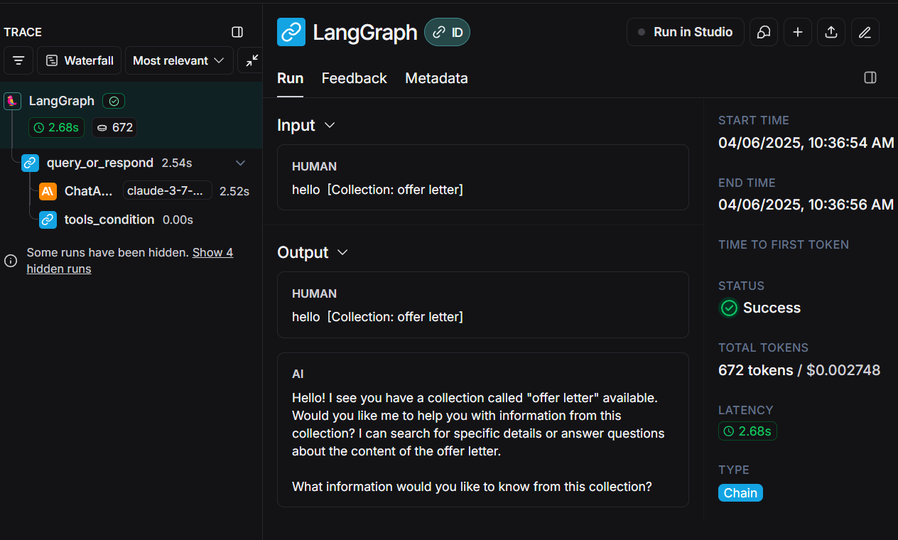
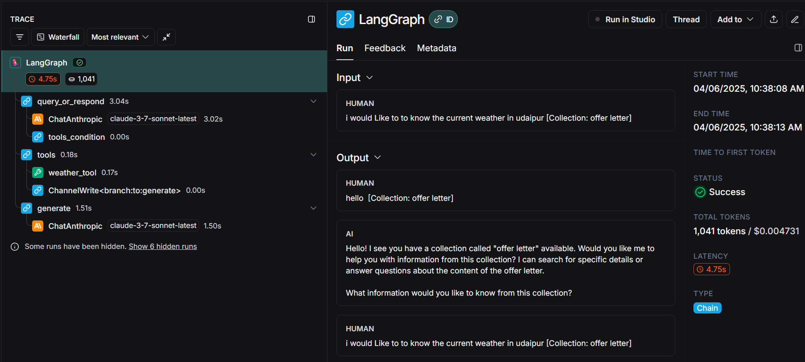
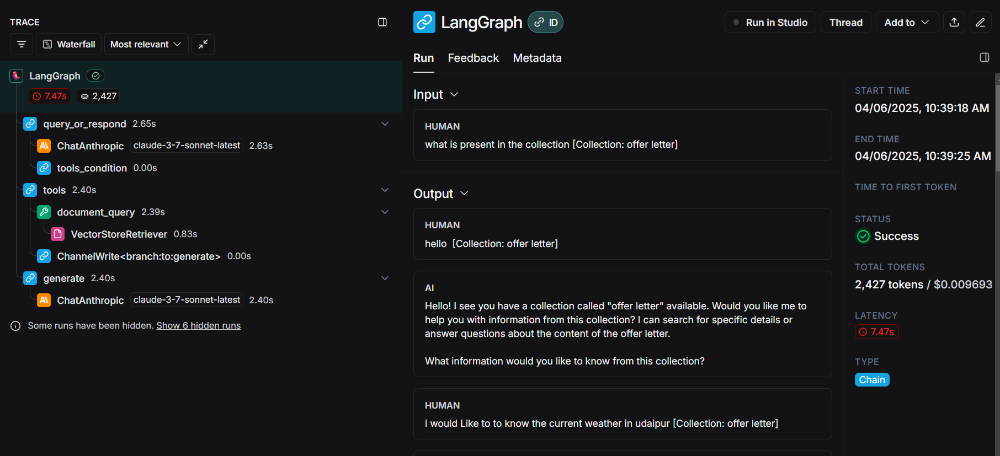
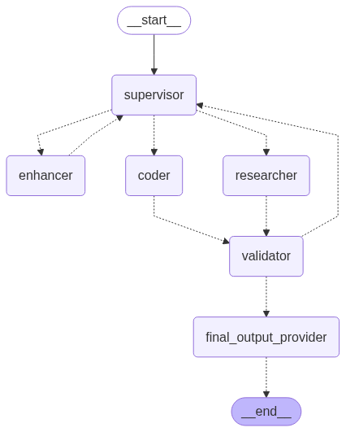

# AI Agent Pipeline with LangChain and LangGraph

This project demonstrates an agentic pipeline using LangChain, LangGraph, and LangSmith, showcasing embeddings, vector databases, RAG, and clean coding practices.

## Current Implementation Status

- ✅ Weather tool using OpenWeatherMap API
- ✅ LangGraph decision-making flow
- ✅ Command-line interface
- ✅ Streamlit UI
- ✅ Unit tests for the weather tool
- ✅ RAG functionality with Qdrant vector database
- ✅ PDF document upload and querying
- ✅ Memory persistence for conversations
- ✅ Streaming responses
- ✅ LangSmith tracing for observability
- 🔄 Langsmith Evaluation for debugging LLM responses (coming soon).

## Features

- **LangGraph Agentic Pipeline** with two functionalities:
  - Real-time weather data using OpenWeatherMap API
  - Question answering from PDF documents using RAG (Retrieval-Augmented Generation)
- **Decision-making node** that determines whether to call the weather API or use RAG
- **LLM Processing** of fetched data using LangChain
- **Vector Database** using Qdrant for storing document embeddings
- **Streamlit UI** for interacting with the agent, uploading PDFs, and managing document collections
- **Memory Persistence** for maintaining conversation context across sessions
- **Streaming Responses** for better user experience
- **LangSmith Tracing** for monitoring and debugging LLM calls

## Project Structure

```
agentic-workflow/
├── src/
│   ├── tools/                           # API tools and utilities
│   │   ├── __init__.py
│   │   ├── weather.py                   # Weather API tool
│   │   ├── document.py                  # Document RAG tool
│   │   └── search_tool.py               # Search functionality
│   ├── graphs/                          # LangGraph flows and agents
│   │   ├── __init__.py
│   │   ├── agent_flow.py                # Main agent flow implementation
│   │   ├── agent_flow_v2.py             # Updated agent flow version
│   │   └── nodes/                       # Individual agent nodes
│   │       ├── __init__.py
│   │       ├── supervisor.py            # Supervisor agent node
│   │       ├── researcher.py            # Research agent node
│   │       ├── coder.py                 # Code generation agent node
│   │       ├── enhancer.py              # Enhancement agent node
│   │       ├── validator.py             # Validation agent node
│   │       └── final_output_provider.py # Final output processing
│   ├── config/                          # Configuration settings
│   │   └── settings.py                  # Application settings
│   ├── ui/                              # Streamlit UI components
│   │   └── streamlit_app.py             # Main Streamlit application
│   ├── utils/                           # Utility functions
│   │   └── utils.py                     # Helper utilities
│   ├── images/                          # Project images and diagrams
│   └── used_documents/                  # Document storage directory
├── tests/                               # Test cases
│   ├── __init__.py
│   ├── conftest.py                      # Test configuration
│   ├── test_weather_tool.py             # Weather tool tests
│   └── test_document_tool.py            # Document tool tests
├── data/                                # Data directory (empty)
├── main.py                              # Command-line interface
├── main_v2.py                           # Updated CLI interface
├── streamlit_app.py                     # Streamlit UI entrypoint
├── 2_supervisor_multiagent_workflow.ipynb # Jupyter notebook demo
├── pyproject.toml                       # Project dependencies and config
├── uv.lock                              # Dependency lock file
├── Dockerfile                           # Docker configuration
├── docker-compose.yml                   # Docker Compose setup
├── README-docker.md                     # Docker documentation
├── .dockerignore                        # Docker ignore file
├── .gitignore                           # Git ignore file
├── .python-version                      # Python version specification
├── LICENSE                              # Project license
└── README.md                            # Project documentation
```

## Setup Instructions

### Prerequisites

- Python 3.10+
- uv for Project Management
- OpenWeatherMap API key
- Anthropic API key or other LLM provider
- Qdrant account (for vector database)
- VoyageAI API key or CohereeAI API key (for embedding generation)
- LangSmith API key (for tracing and evaluation)

### Installation

#### Option 1: Using uv (Recommended)

1. Clone the repository:
   ```bash
   git clone https://github.com/pranawmishra/agentic-workflow.git
   cd agentic-workflow
   ```

2. Install dependencies using uv:
   ```bash
   uv sync
   ```
   > ⚠️ **Note:** This automatically creates the virtual environment and installs all dependencies from [`pyproject.toml`](./pyproject.toml).

#### Option 2: Using Docker

1. Clone the repository:
   ```bash
   git clone https://github.com/pranawmishra/agentic-workflow.git
   cd agentic-workflow
   ```

2. Create your `.env` file (see configuration section below)

3. Build and run with Docker Compose:
   ```bash
   docker-compose up -d
   ```

4. Access the application at: http://localhost:8501

For detailed Docker instructions, see [README-docker.md](./README-docker.md).

### Configuration

Create a `.env` file in the project root with your API keys:

```env
# Required API Keys
OPENWEATHER_API_KEY=your_openweather_api_key
ANTHROPIC_API_KEY=your_anthropic_api_key

# Embedding Provider (choose one)
VOYAGEAI_API_KEY=your_voyageai_api_key
# OR
COHERE_API_KEY=your_cohere_api_key

# Vector Database
QDRANT_URL=your_qdrant_url
QDRANT_API_KEY=your_qdrant_api_key

# LangSmith tracing (optional)
LANGSMITH_TRACING=true
LANGSMITH_API_KEY=your_langsmith_api_key

# Search Tool (optional)
TAVILY_API_KEY=your_tavily_api_key
```

### Verify Installation

Test your installation by running:

```bash
# Using uv
python -m uv run python -c "import src.tools.weather; print('Installation successful!')"

# Run tests
python -m uv run pytest
```

### Enabling LangSmith Tracing

LangSmith tracing is automatically enabled when the environment variables are set in your `.env` file. This allows you to:
- Monitor all LLM calls and chain executions
- Debug complex workflows
- Analyze token usage and costs
- Optimize your agent's performance

No code changes are required - just add the environment variables and tracing will be active for all LangChain components.

## Usage

### Command Line Interface

Run the assistant from the command line:

```bash
python -m uv run main.py 
```

### Streamlit UI

Run the Streamlit interface:

```bash
python -m uv run streamlit run streamlit_app.py
```

The Streamlit UI provides:
- A chat interface for interacting with the agent
- A sidebar for uploading PDF documents
- A collection selector for choosing which document to query
- Visual feedback for document processing stages

### Running Tests

Run the test suite:

```bash
python -m uv run pytest
```


## Implementation Details

### Weather Tool

The weather tool uses the OpenWeatherMap API to fetch real-time weather data for a given location. It extracts the location from the user's query using an LLM and then makes an API call to get the weather information.

### Document Tool

The document tool provides RAG (Retrieval Augmented Generation) capabilities:
1. **PDF Upload**: Users can upload PDF documents via the Streamlit UI
2. **Vector Database**: Documents are processed, split into chunks, and stored in a Qdrant vector database
3. **Semantic Search**: When a user asks a question, the system retrieves the most relevant document chunks
4. **LLM Response**: The LLM generates a response based on the retrieved information

### LangGraph Flow

The project uses LangGraph to create a stateful agent with nodes for:
1. **Decision Making**: Determines which tool to use based on the query
2. **Tool Execution**: Handles weather-related queries or document-related queries
3. **Response Generation**: Generates the final response
4. **Memory Management**: Maintains conversation history across sessions

### Memory Persistence

Conversations maintain context across multiple interactions using:
- Thread-based memory in LangGraph
- Unique conversation IDs for each session
- Persistent Qdrant collections for document storage

### LangSmith Tracing

All LLM calls, chain executions, and tool invocations are automatically traced when LangSmith environment variables are properly configured. This provides:
- Detailed logs of each step in the agent's workflow
- Input/output visibility for debugging
- Performance metrics for optimization
- Token usage tracking for cost analysis

## Future Enhancements

- Advanced evaluation using LangSmith
- Multi-modal support for images and other media
- Support for more document formats (beyond PDFs)
- Advanced RAG techniques like hybrid search and re-ranking

## UI Preview


## Langsmith Tracing







## Working URL

Please [click here](https://agentic-workflow-h2bpzkxwmxfenxcn2ivdp3.streamlit.app/) for a working demo of the project

## Multi-Agent Architecture

